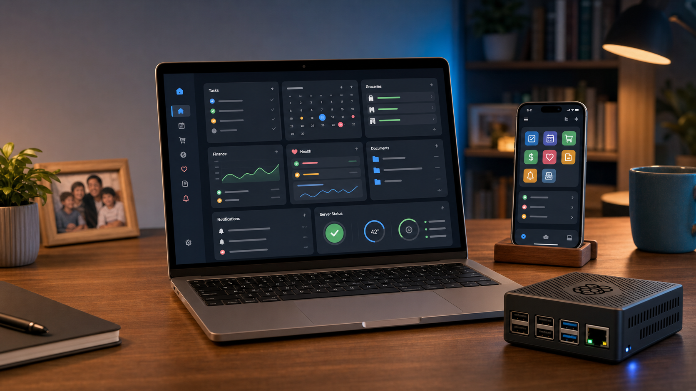

# Family Organizer - app quản lý gia đình tự host



Family Organizer là một ứng dụng quản lý gia đình chạy trên web/PWA, được thiết kế để cả nhà cùng dùng mỗi ngày: giao việc, xem lịch, ghi chú, đi chợ, quản lý chi tiêu, theo dõi sức khỏe, lưu giấy tờ và nhận nhắc nhở. Điểm hay của app là bạn có thể tự host trên Raspberry Pi hoặc một máy Linux nhỏ trong nhà, dữ liệu nằm trong máy của mình, vẫn có realtime sync và có thể cài như app trên điện thoại.

Repo hiện tại hướng tới mô hình "home server": một máy chủ nhỏ chạy 24/7, các thành viên truy cập bằng trình duyệt hoặc PWA trên iPhone/Android/laptop.

## Tính năng nổi bật

### Tổng quan gia đình

Màn hình tổng quan gom các việc cần chú ý trong ngày: task sắp đến hạn, lịch sắp tới, ghi chú ghim, nhắc thuốc, sinh nhật, tình hình tài chính và các hoạt động gần đây. Đây là màn hình nên mở đầu tiên mỗi sáng để cả nhà biết hôm nay cần làm gì.

### Task và điểm thưởng

App hỗ trợ tạo task, phân công cho từng thành viên, đặt hạn, mức ưu tiên, tag, bình luận và lịch sử thay đổi. Task có thể là việc riêng hoặc việc chung cho cả nhà. Với tài khoản trẻ em, người lớn có thể cộng điểm thưởng khi hoàn thành việc, phù hợp cho các việc như dọn phòng, học bài, đọc sách, phụ bếp.

Một số task có thể lặp lại theo ngày/tuần/tháng và xoay vòng người nhận, hữu ích cho các việc gia đình như đổ rác, lau bàn, tưới cây, chuẩn bị đồ đi học.

### Lịch gia đình

Module lịch dùng để lưu sự kiện một ngày hoặc nhiều ngày, lịch lặp, lịch riêng hoặc lịch chia sẻ. App có nhắc sự kiện sắp diễn ra, hiển thị sinh nhật thành viên và các ngày lễ Việt Nam. Khi cần đưa sự kiện sang điện thoại, app có xuất file `.ics` để thêm vào lịch iOS/Android/Google Calendar.

### Ghi chú Markdown

Ghi chú hỗ trợ Markdown, ghim ghi chú quan trọng, tag, quyền riêng tư và quyền chỉnh sửa theo vai trò. Có thể dùng cho danh sách số điện thoại, hướng dẫn chăm bé, checklist đi du lịch, món ăn gia đình, quy ước chi tiêu hoặc các thông tin cả nhà hay quên.

Nếu cấu hình Gemini API key, app có thêm AI viết nháp ghi chú: nhập ý chính, app tạo nội dung Markdown rồi bạn chỉnh lại.

### Đi chợ và thực đơn

Danh sách đi chợ là danh sách chung, ai mua xong có thể đánh dấu đã mua. App có phần tạo thực đơn tuần và sinh danh sách nguyên liệu. Có hai chế độ: đổi thực đơn từ thư viện món có sẵn hoặc tạo bằng AI khi đã cấu hình Gemini. Bạn có thể nhập số người lớn, số trẻ em, số ngày và ghi chú như dị ứng, món kiêng, ngân sách, sở thích.

### Thu chi, ngân sách và tài sản

Module tài chính dành cho Admin/Member, ẩn với Child/Guest. App hỗ trợ ghi thu/chi, tài khoản tiền mặt/ngân hàng/ví điện tử, hạng mục chi tiêu, ảnh hóa đơn, biểu đồ, ngân sách theo tháng/kỳ, hóa đơn định kỳ, mục tiêu tiết kiệm và theo dõi nợ vay/cho mượn.

Phần tài sản gia đình hỗ trợ nhiều loại: crypto, vàng, đất/BĐS, xe, cổ phiếu và tài sản khác. App có widget giá thị trường như BTC, ETH, vàng SJC và USD/VND; có tính giá trị ước tính, giá mua ban đầu, lãi/lỗ và ảnh tài sản.

### Giấy tờ gia đình

Kho giấy tờ giúp lưu CCCD/CMND, hộ chiếu, bằng lái, đăng ký xe, đăng kiểm, bảo hiểm, bảo hành, hợp đồng, giấy khai sinh/kết hôn và các tài liệu khác. Mỗi giấy tờ có thể có chủ sở hữu, số giấy tờ, nơi cấp, ngày cấp, ngày hết hạn và file scan/ảnh đính kèm. App có nhắc giấy tờ sắp hết hạn.

### Sức khỏe gia đình

Khu sức khỏe có ba phần chính: tăng trưởng, tiêm chủng và lịch thuốc. Bạn có thể lưu chiều cao/cân nặng, xem biểu đồ nhỏ và BMI; lưu lịch tiêm vaccine; tạo lịch uống thuốc theo giờ 24h, đánh dấu đã uống/bỏ qua từng liều và nhận nhắc thuốc.

### Thông báo, PWA và realtime

Family Organizer dùng Server-Sent Events để đồng bộ thay đổi realtime giữa các thiết bị. Khi người này thêm task hoặc cập nhật danh sách đi chợ, người khác không cần tải lại trang.

App cũng là PWA: có thể cài lên màn hình chính điện thoại, mở như app native, có service worker và shortcut nhanh tới Task, Đi chợ, Nhắc thuốc, Chi tiêu. Nếu cấu hình VAPID, app gửi web push notification và badge trên icon, kể cả khi PWA đang đóng.

### Quản trị và vận hành

Admin quản lý thành viên, vai trò, hồ sơ, mật khẩu, backup/restore, log hoạt động, Gemini API key, cập nhật app qua Watchtower và xem server monitor. Tab Quản lý Server hiển thị CPU, RAM, nhiệt độ, ổ đĩa, uptime và lịch sử telemetry, rất hợp khi chạy trên Raspberry Pi.

## Phân quyền

App dùng phân quyền theo vai trò:

| Vai trò | Phù hợp cho | Quyền chính |
| --- | --- | --- |
| Admin | Ba/mẹ/người quản trị server | Toàn quyền, quản lý thành viên, backup/restore, cập nhật app, xem server |
| Member | Người lớn trong nhà | Dùng đầy đủ nội dung gia đình, truy cập tài chính, quản lý thuốc |
| Child | Trẻ em/con | Tạo nội dung cá nhân, xem nội dung được chia sẻ, nhận điểm thưởng, không xem tài chính |
| Guest | Khách/người chỉ cần xem | Chủ yếu đọc nội dung được chia sẻ |

## Cách sử dụng nhanh sau khi cài

1. Đăng nhập lần đầu bằng tài khoản mặc định `admin` / `admin123`.
2. Vào Settings, đổi mật khẩu admin ngay.
3. Tạo tài khoản thật cho từng thành viên trong nhà, chọn vai trò và quan hệ gia đình.
4. Cập nhật hồ sơ: ảnh đại diện, ngày sinh, giới tính, số điện thoại nếu cần.
5. Tạo vài task lặp lại cho các việc nhà cố định.
6. Thêm lịch sinh hoạt quan trọng: học thêm, khám bệnh, đóng tiền, sự kiện gia đình.
7. Bật danh sách đi chợ chung và thử tạo thực đơn tuần.
8. Nếu dùng tài chính, nhập ngân sách tháng, hóa đơn định kỳ và vài khoản thu/chi đầu tiên.
9. Lưu các giấy tờ có ngày hết hạn để app nhắc trước.
10. Cài PWA lên điện thoại của từng người và bật thông báo đẩy nếu server đã cấu hình VAPID.

## Cấu hình phần cứng khuyến nghị

Family Organizer là app Node.js + React + SQLite, không cần phần cứng lớn. Cấu hình đẹp nhất là một máy nhỏ chạy 24/7 trong nhà.

| Nhu cầu | Cấu hình gợi ý |
| --- | --- |
| Dùng thử / dev | Laptop hoặc PC có Node.js 20+, Docker tùy chọn |
| Gia đình dùng thật | Raspberry Pi 5 RAM 4GB hoặc 8GB, nguồn USB-C 5V/5A, tản nhiệt chủ động, thẻ microSD 32GB+ hoặc SSD |
| Dữ liệu nhiều ảnh/tài liệu | Raspberry Pi 5 + SSD/NVMe 128GB+, backup định kỳ sang ổ rời/NAS/cloud |
| Muốn ổn định lâu dài | Kết nối Ethernet, UPS mini nếu khu vực hay mất điện, tự động backup và kiểm tra dung lượng ổ |
| Truy cập ngoài nhà | Tailscale, VPN riêng hoặc reverse proxy HTTPS; hạn chế mở thẳng port ra Internet |

Ghi chú phần cứng:

- Raspberry Pi 5 có CPU Arm Cortex-A76 2.4GHz, RAM tối đa 16GB, microSD, USB 3, Gigabit Ethernet và PCIe cho SSD qua HAT/adapter. Với app này, bản 4GB đã đủ cho gia đình nhỏ; bản 8GB thoải mái hơn nếu chạy thêm dịch vụ khác.
- Nên dùng nguồn 5V/5A chất lượng tốt và có quạt/tản nhiệt, đặc biệt khi chạy 24/7.
- Nếu lưu nhiều ảnh hóa đơn, giấy tờ, tài sản, nên dùng SSD thay vì chỉ microSD.
- Dữ liệu nằm trong thư mục `./data/`, gồm SQLite database, uploads và backups. Hãy backup thư mục này định kỳ ra thiết bị khác.

## Cài đặt production bằng Docker

Yêu cầu:

- Raspberry Pi OS/Debian/Ubuntu hoặc máy Linux tương đương.
- Docker Engine và Docker Compose v2.
- Git.
- Kết nối mạng nội bộ ổn định.

Các bước cơ bản:

```bash
git clone https://github.com/happysmartlight/Family-Organizer.git
cd Family-Organizer
cp .env.example .env
```

Sửa file `.env`:

```env
GEMINI_API_KEY=your_gemini_api_key_here
APP_URL=https://your-domain-or-tailscale-url
WATCHTOWER_HTTP_API_TOKEN=your_secret_token_here
VAPID_PUBLIC_KEY=your_vapid_public_key_here
VAPID_PRIVATE_KEY=your_vapid_private_key_here
VAPID_SUBJECT=mailto:you@example.com
```

Trong đó:

- `GEMINI_API_KEY`: tùy chọn, dùng cho AI assistant, viết ghi chú và gợi ý thực đơn.
- `APP_URL`: URL ngoài của app nếu dùng domain/Tailscale/reverse proxy.
- `WATCHTOWER_HTTP_API_TOKEN`: cần nếu muốn bấm cập nhật app trong giao diện.
- `VAPID_PUBLIC_KEY`, `VAPID_PRIVATE_KEY`, `VAPID_SUBJECT`: tùy chọn, dùng cho web push notification. Để trống thì app vẫn chạy, chỉ không có push notification.

Kiểm tra `docker-compose.yml` trước khi chạy. File hiện tại bind port vào `127.0.0.1:3001` và một IP LAN mẫu `192.168.1.2:3001`; hãy đổi `192.168.1.2` thành IP thật của máy chủ, hoặc điều chỉnh theo mô hình mạng của bạn.

Khởi chạy:

```bash
docker compose up -d
```

Truy cập:

- Trên chính máy server: `http://localhost:3001`
- Trong mạng LAN: `http://<ip-may-chu>:3001`

Nếu dùng Tailscale, có thể dùng Tailscale Serve để chia sẻ service trong tailnet, ví dụ trỏ tới `localhost:3001`. Nếu public ra Internet, nên dùng HTTPS và kiểm soát quyền truy cập cẩn thận.

## Cập nhật app

Có hai cách:

1. Trong app: Admin vào Settings, kiểm tra phiên bản và bấm cập nhật nếu Watchtower đã cấu hình token.
2. Trên server:

```bash
git pull
docker compose pull
docker compose up -d
```

## Backup và khôi phục

App tự tạo backup định kỳ trong `./data/backups/`. Admin cũng có thể tạo backup thủ công trong Settings. Vì backup nằm cùng máy với dữ liệu chính, bạn nên định kỳ copy `./data/` hoặc ít nhất `./data/backups/` sang ổ khác.

Khi restore, app nạp lại snapshot dữ liệu vào SQLite. Nên tạo backup mới trước khi restore nếu đang có dữ liệu quan trọng.

## Chạy dev local

Dành cho người muốn sửa code hoặc gửi PR:

```bash
npm install
cp .env.example .env
npm run dev
```

Mặc định app dev chạy tại `http://localhost:3000`.

Kiểm tra trước khi gửi PR:

```bash
npm test
npm run lint
npm run build
```

## Mời cộng đồng fork và gửi PR

Family Organizer rất hợp để cộng đồng cùng cải tiến vì mỗi gia đình có một cách vận hành khác nhau. Nếu bạn dùng app và thấy bug, thiếu workflow hoặc có ý tưởng hay, rất mong bạn fork repo và gửi PR.

Những đóng góp được chào đón:

- Fix bug UI/mobile/PWA.
- Cải thiện trải nghiệm nhập liệu cho task, lịch, đi chợ, tài chính.
- Thêm test cho logic tài sản, ngân sách, nhắc lịch, phân quyền.
- Cải thiện deploy trên Raspberry Pi, NAS, mini PC, reverse proxy.
- Viết tài liệu hướng dẫn cho người không rành kỹ thuật.
- Tối ưu hiệu năng SQLite, upload ảnh, backup/restore.
- Cải thiện accessibility và responsive layout.

Khi gửi issue/PR, nên kèm:

- Mô tả lỗi hoặc nhu cầu.
- Các bước tái hiện.
- Ảnh chụp màn hình nếu là lỗi giao diện.
- Môi trường chạy: Raspberry Pi/PC, OS, Docker hay dev local.
- Kết quả `npm test`, `npm run lint`, `npm run build` nếu có sửa code.

## Lưu ý bảo mật

- Đổi mật khẩu `admin/admin123` ngay sau khi cài.
- Không commit file `.env`.
- Không public app ra Internet nếu chưa có HTTPS, mật khẩu mạnh và cơ chế truy cập phù hợp.
- Gemini API key có thể nhập trong Settings hoặc `.env`; hãy xem đây là secret.
- Sao lưu `./data/` thường xuyên, nhất là nếu lưu giấy tờ và ảnh tài sản.

## Nguồn tham khảo phần triển khai

- Raspberry Pi 5 product page: https://www.raspberrypi.com/products/raspberry-pi-5/
- Docker Engine on Debian: https://docs.docker.com/engine/install/debian/
- Tailscale Serve command: https://tailscale.com/docs/reference/tailscale-cli/serve
